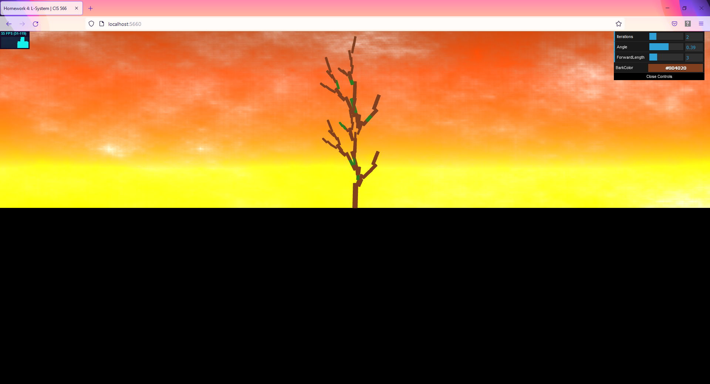

# L-Systems

## Nathan Devlin - @ndevlin - ndevlin@seas.upenn.edu - www.ndevlin.com

Result:

## Live Demo
View a live WebGL Demo here!:
https://ndevlin.github.io/hw04-l-systems/

## Project Description

An interactive L-Systems creator that uses instance rendering to quickly render a large number of sub-components to create a tree structure. The Iterations slider controls the number of LSystem iterations; more iterations creates a larger tree. The Angle controls default angle for rotations in the LSystem (in radians). ForwardLength controls the distance that one forward step corresponds to. Bark Color allows you to change the default color of the bark of the LSystem.

## Implementation Details

This project is implemented in TypeScript and GLSL using WebGL, Node.js, and Visual Studio Code. It has 2 main sections; LSystem creation, and geometry rendering. LSystem, Turtle, and ExpansionRule classes handle the creation and expansion of LSystem geometry. Upon Expansion, a new string array replaces the current string by drawing from the set of potential expansion options in the ExpansionRule for that string. 

Drawing Rule, Cylinder, ScreenQuad, Drawable, OpenGLRenderer, and ShaderProgram classes, as well as the GLSL shaders, handle the rendering of the geometry specified by the LSystem classes. A Single Cylinder, specified in the Cylinder class, is repeatedly instanced to create the resulting tree. To accomplish this, appropriate transformation matrices are calculated and compacted within the LSystem class and then passed to the shaders to be repositioned, colored, and drawn. The cylinders are scaled such that newer branches are smaller than older ones.

Function pointers are used to connect LSystem rules to Drawing operations. When a Drawing operation is selected, say a rotation about the Z axis, a transfomation matrix is calculated and multiplied by the current transformation at this position. Once the transformations and offsets required to draw this geometry at the appropriate location and orientation are calculated and concatenated, the resulting matrix is split into 4 vectors which are then passed into the vertex shader to reposition the instanced geometry.

The LSystem creates rotation about the X, Y, and Z axes to create a 3-Dimensional form. The system also draws leaves in the form of green squares. I would like to add a texture so as to draw a leaf image on top of these squares later. The angle is controlled by the user, but a random offset is also added to give some organic variation. 

The background is created by mixing Fractal Brownian Noise, which creates a cloud effect, with a sunset gradient created according to the pixel y coordinates. 

The user can additionally control 4 elements of the LSystem instancer: the default angle for rotations, the number of LSystem iterations, the distance traveled for each forward step, and the default color.

